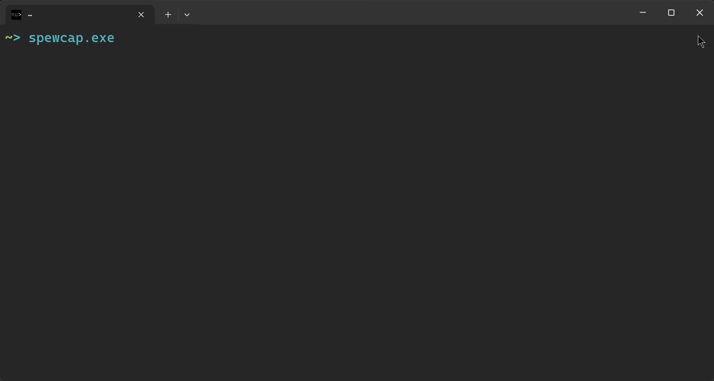

# spewcap

`spewcap` is a Rust-based command-line application for capturing and logging serial port data. It provides a user-friendly interface for managing serial port connections, capturing data, and saving logs.



## Features

- Connect to serial ports and capture data.
- Start, pause, and resume data capture.
- Start new logs and save active logs.
- Display help messages with available commands.
- Configurable settings via command-line arguments and/or configuration file.

## Installation

1. Ensure Rust is installed or install it from [rust-lang.org](https://www.rust-lang.org/).
2. Clone the repository:
    ```sh
    git clone https://github.com/yourusername/spewcap2.git
    cd spewcap2
    ```
3. Build the project:
    ```sh
    cargo build --release
    ```

## Usage

Run the application with:
```sh
cargo run --release
```

or copy the executable somewhere else and run from there
```sh
cp target/release/spewcap2.exe ~/spewcap/
~/spewcap/spewcap2.exe
```

### Command-Line Arguments

- `-p, --port <PORT>`: Specify the serial port (e.g., "COM3", "/dev/ttyUSB0").
- `-b, --baud-rate <BAUD_RATE>`: Specify the baud rate (default: 115200).
- `-t, --timestamps`: Prepend timestamps in the log.
- `-l, --log-on-start`: Start logging immediately on application start.
- `-f, --log-folder <FOLDER>`: Specify the folder path to save logs.
- `--list`: List available serial ports.

### Configuration File

You can also configure the application using a spewcap_config.toml file. The configuration file should be placed in the same directory as the executable or the current working directory.

Example spewcap_config.toml:
```toml
port = "COM3"
baud_rate = 115200
log_folder = "logs"
timestamps = false
log_on_start = false
disable_welcome = false
```

### Commands

- `Q`: Quit the application.
- `C`: Clear the console.
- `P`: Pause/resume capture.
- `N`: Start a new log.
- `L`: Pause/resume logging.
- `S`: Save active log as...
- `H`: Display help message.

## Acknowledgements

- [serust](https://github.com/thewh1teagle/serust)
- [serialport5](https://crates.io/crates/serialport5)
